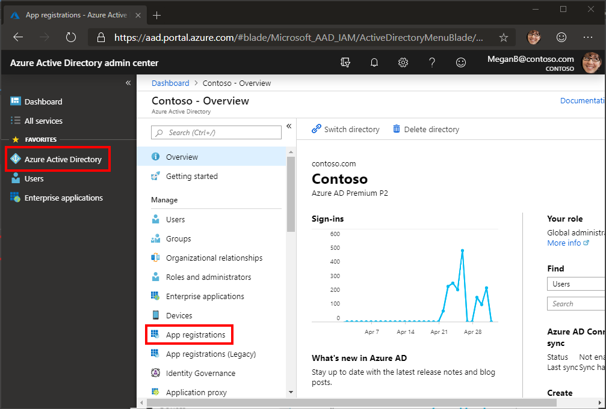
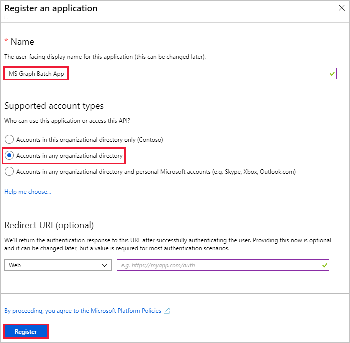
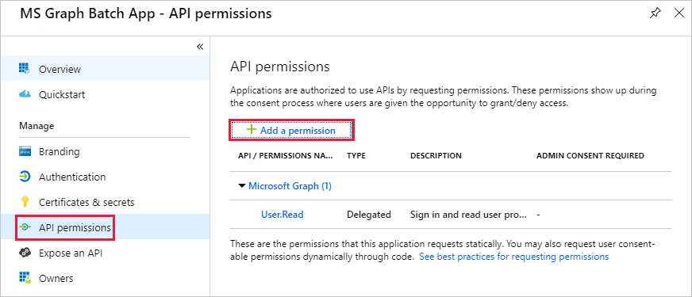
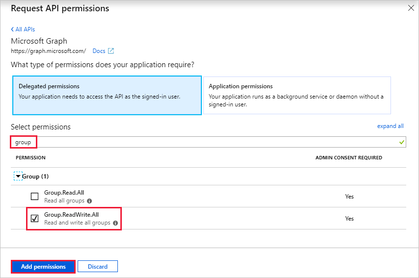
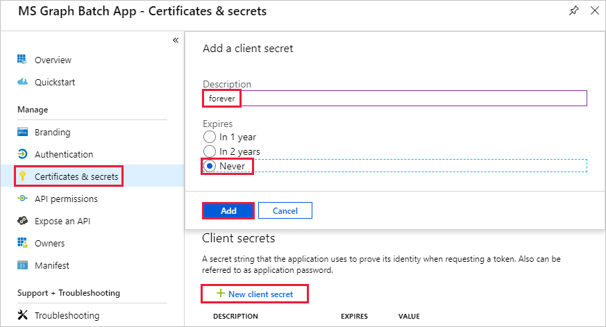
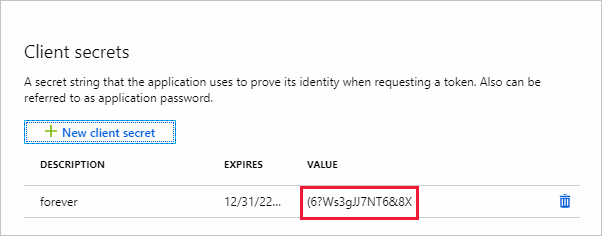

<!-- markdownlint-disable MD002 MD041 -->

En este ejercicio, creará una nueva aplicación de Azure Active Directory que se usará para proporcionar los permisos delegados para el conector personalizado.

Abra un explorador y vaya al [centro de administración de Azure Active Directory](https://aad.portal.azure.com). Elija el vínculo de **Azure Active Directory** en el menú de navegación de la izquierda y, después, elija la entrada **registros de aplicaciones** en la sección **administrar** de la hoja **Azure Active Directory** .

Elija el elemento de menú **registro nuevo** en la parte superior de la hoja **registros de aplicaciones** .

Escriba `MS Graph Batch App` en el campo **nombre** . En la sección **tipos de cuenta admitidos** , seleccione **cuentas en cualquier directorio de la organización**. Deje en blanco la sección **URI de redireccionamiento** y elija **registrar**.

En la hoja **aplicación para lotes de MS Graph** , copie el identificador de la **aplicación (cliente)**. Lo necesitará en el siguiente ejercicio.

Elija la entrada **permisos de API** en la sección **administrar** de la hoja **aplicación por lotes de MS Graph** . Elija **Agregar un permiso** en **permisos**de la API.

En la hoja **solicitar permisos de API** , elija **Microsoft Graph**y, a continuación, elija **permisos delegados**. Busque `group` y, a continuación, seleccione el permiso delegados **leer y escribir en todos los grupos** . Elija **Agregar permisos** en la parte inferior de la hoja.

 

Elija la entrada **certificados y secretos** en la sección **administrar** de la hoja de la **aplicación batch de MS Graph** y, a continuación, elija **nuevo secreto de cliente**. Escriba `forever` en la **Descripción** y seleccione **nunca** en **Expires**. Seleccione **Agregar**.

Copie el valor del nuevo secreto. Lo necesitará en el siguiente ejercicio.

> [!IMPORTANT]
> Este paso es fundamental ya que no se podrá acceder al secreto una vez que cierre esta hoja. Guarde este secreto en un editor de texto para usarlo en los ejercicios venideros.

Para habilitar la administración de servicios adicionales a los que se puede tener acceso a través de Microsoft Graph, incluidas las propiedades de Team, debe seleccionar ámbitos apropiados adicionales para habilitar la administración de servicios específicos. Por ejemplo, para ampliar nuestra solución para habilitar la creación de blocs de notas de OneNote o los planes de planeación, las tareas que necesitaría agregar los ámbitos de permisos necesarios para las API relevantes.
