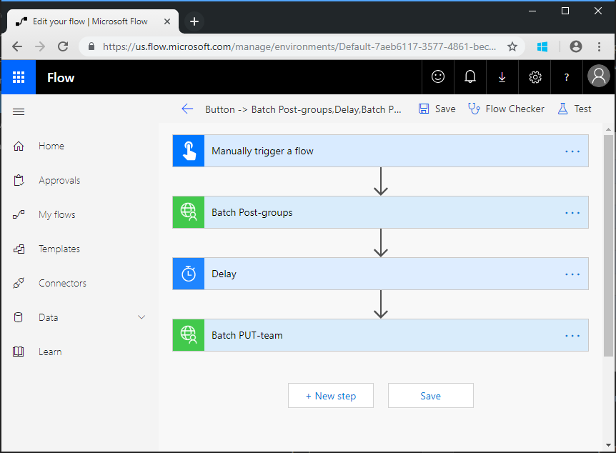
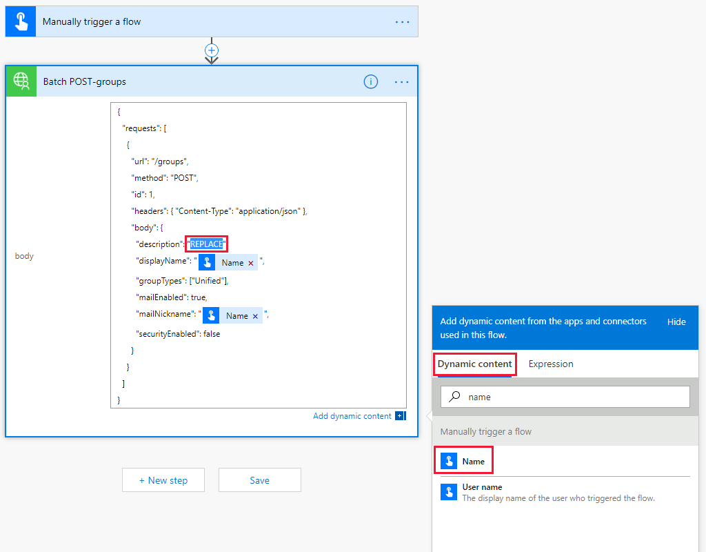
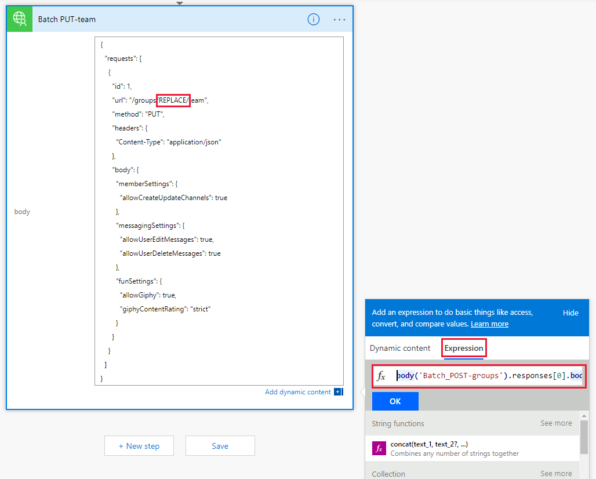
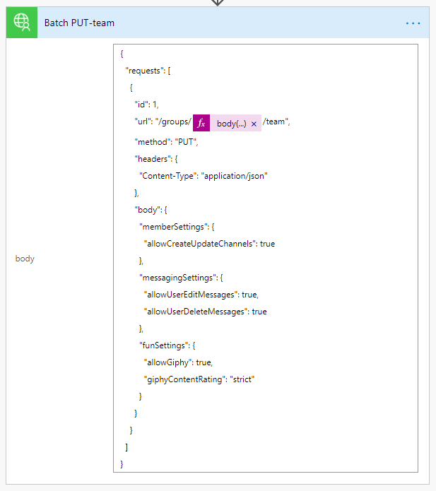
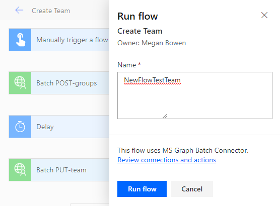
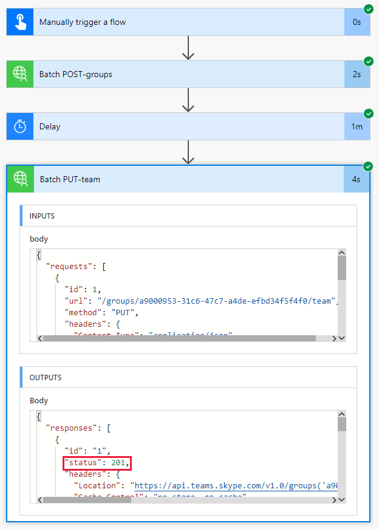

<!-- markdownlint-disable MD002 MD041 -->

En este ejercicio, creará un flujo para usar el conector personalizado que creó en los ejercicios anteriores para crear y configurar un equipo de Microsoft. El flujo usará el conector personalizado para enviar una solicitud POST para crear un Grupo Unificado de Office 365, pausará un retraso mientras se completa la creación del grupo y enviará una solicitud PUT para asociar el grupo con un equipo de Microsoft.

En el final el flujo tendrá un aspecto similar al de la siguiente imagen:



Abra [Microsoft Power automatizada](https://flow.microsoft.com) en el explorador e inicie sesión con su cuenta de administrador de inquilinos de Office 365. Elija **Mis flujos** en el panel de navegación izquierdo. Elija **nuevo**y luego **instantánea--en blanco**. Escriba `Create Team` para **nombre de flujo**y, a continuación, seleccione **desencadenar manualmente un flujo** en **elegir cómo activar este flujo**. Seleccione **Crear**.

Seleccione **desencadenar manualmente un** elemento de flujo y, a continuación, elija **Agregar una entrada**, seleccione **texto** y escriba `Name` como título.


Elija **nuevo paso** y escriba `Batch` en el cuadro de búsqueda. Agregue la acción **conector por lotes de MS Graph** . Elija los puntos suspensivos y cambie el nombre de esta acción a `Batch POST-groups` .

Agregue el código siguiente en el cuadro de texto **Body** de la acción.

```json
{
  "requests": [
    {
      "url": "/groups",
      "method": "POST",
      "id": 1,
      "headers": { "Content-Type": "application/json" },
      "body": {
        "description": "REPLACE",
        "displayName": "REPLACE",
        "groupTypes": ["Unified"],
        "mailEnabled": true,
        "mailNickname": "REPLACE",
        "securityEnabled": false
      }
    }
  ]
}
```

Reemplace cada `REPLACE` marcador de posición seleccionando el `Name` valor en el desencadenador manual del menú **agregar contenido dinámico** .



Elija **nuevo paso**, busque `delay` y agregue una acción de **retraso** y configure por 1 minuto.

Elija **nuevo paso** y escriba `Batch` en el cuadro de búsqueda. Agregue la acción **conector por lotes de MS Graph** . Elija los puntos suspensivos y cambie el nombre de esta acción a `Batch PUT-team` .

Agregue el código siguiente en el cuadro de texto **Body** de la acción.

```json
{
  "requests": [
    {
      "id": 1,
      "url": "/groups/REPLACE/team",
      "method": "PUT",
      "headers": {
        "Content-Type": "application/json"
      },
      "body": {
        "memberSettings": {
          "allowCreateUpdateChannels": true
        },
        "messagingSettings": {
          "allowUserEditMessages": true,
          "allowUserDeleteMessages": true
        },
        "funSettings": {
          "allowGiphy": true,
          "giphyContentRating": "strict"
        }
      }
    }
  ]
}
```

Seleccione el `REPLACE` marcador de posición y, a continuación, seleccione **expresión** en el panel contenido dinámico. Agregue la fórmula siguiente a la **expresión**.

```js
body('Batch_POST-groups').responses[0].body.id
```



Esta fórmula especifica que queremos usar el identificador de grupo del resultado de la primera acción.



Elija **Guardar**y, a continuación, elija **prueba** para ejecutar el flujo.

> [!TIP]
> Si recibe un error como `The template validation failed: 'The action(s) 'Batch_POST-groups' referenced by 'inputs' in action 'Batch_2' are not defined in the template'` el siguiente, la expresión es incorrecta y es probable que haga referencia a una acción de flujo que no puede encontrar. Asegúrese de que el nombre de la acción al que hace referencia coincide exactamente.

Elija el botón de opción **voy a realizar la acción desencadenadora** y elija **Guardar & prueba**. Elija **continuar** en el cuadro de diálogo. Proporcione un nombre sin espacios y elija **Ejecutar flujo** para crear un equipo.



Por último, elija el **listo** para ver el registro de actividades. Una vez que se haya completado el flujo, el grupo y el equipo de 365 de Office se han configurado. Seleccione los elementos de acción por lotes para ver los resultados de las llamadas de lotes JSON. La `outputs` de la `Batch PUT-team` acción debe tener un código de estado de 201 para una asociación de equipo correcta similar a la imagen siguiente.


