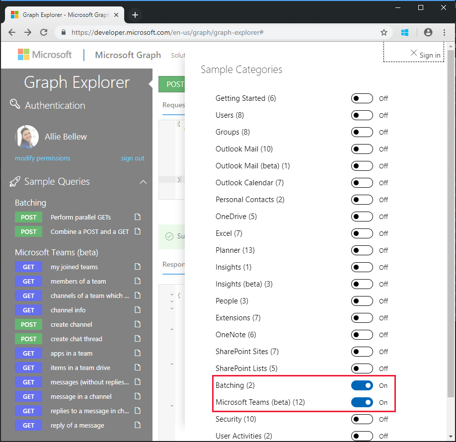
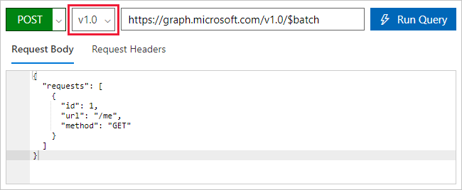
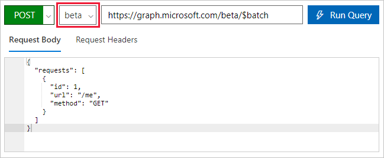

<!-- markdownlint-disable MD002 MD041 -->

Antes de crear un flujo para usar el nuevo conector, use el [Explorador de Microsoft Graph](https://developer.microsoft.com/graph/graph-explorer) para descubrir algunas de las capacidades y características del procesamiento por lotes de JSON en Microsoft Graph.

Abra el [Explorador de Microsoft Graph](https://developer.microsoft.com/graph/graph-explorer) en el explorador. Inicie sesión con su cuenta de administrador de inquilinos de Office 365. Elija el vínculo **Mostrar más ejemplos** en el panel de navegación izquierdo y alterne los ejemplos para **procesamiento por lotes** y **Microsoft Teams (beta)** en **activado**.



Seleccione la consulta realizar ejemplo de **Get Parallel** en el menú de la izquierda. Elija el botón **Ejecutar consulta** en la parte superior derecha de la pantalla.

La operación por lotes de ejemplo procesa por lotes tres solicitudes HTTP GET y emite un solo HTTP `/v1.0/$batch` post al punto de conexión del grafo.

```json
{
  "requests": [
    {
      "url": "/me?$select=displayName,jobTitle,userPrincipalName",
      "method": "GET",
      "id": "1"
    },
    {
      "url": "/me/messages?$filter=importance eq 'high'&$select=from,subject,receivedDateTime,bodyPreview",
      "method": "GET",
      "id": "2"
    },
    {
      "url": "/me/events",
      "method": "GET",
      "id": "3"
    }
  ]
}
```

La respuesta devuelta se muestra a continuación. Tenga en cuenta la matriz de respuestas que devuelve Microsoft Graph. Las respuestas a las solicitudes por lotes pueden aparecer en un orden diferente que el orden de las solicitudes en la publicación. La `id` propiedad debe usarse para correlacionar solicitudes de lote individuales con respuestas de lotes específicas.

> [!NOTE]
> La respuesta se ha truncado para facilitar su lectura.

```json
{
  "responses": [
    {
      "id": "1",
      "status": 200,
      "headers": {...},
      "body": {...}
    },
    {
      "id": "3",
      "status": 200,
      "headers": {...},
      "body": {...}
    }
    {
      "id": "2",
      "status": 200,
      "headers": {...},
      "body": {...}
    }
  ]
}
```

Cada respuesta contiene una `id`propiedad `status`, `headers`, y `body` . Si la `status` propiedad de una solicitud indica un error, el `body` contiene cualquier información de error devuelta por la solicitud.

Para garantizar un orden de operaciones para las solicitudes, las solicitudes individuales se pueden secuenciar mediante la propiedad [DEPENDSON](https://docs.microsoft.com/graph/json-batching#sequencing-requests-with-the-dependson-property) .

Además de las operaciones de secuencia y dependencia, el procesamiento por lotes de JSON asume una ruta de acceso base y ejecuta las solicitudes de una ruta de acceso relativa. Cada elemento de solicitud de lote se ejecuta desde `/v1.0/$batch` los `/beta/$batch` extremos o como se especifique. Esto puede tener diferencias considerables porque `/beta` el extremo puede devolver un resultado adicional que no se puede devolver `/v1.0` en el punto de conexión.

Por ejemplo, ejecute las dos consultas siguientes en el [probador de Microsoft Graph](https://developer.microsoft.com/graph/graph-explorer).

1. Consulte el `/v1.0/$batch` extremo mediante la dirección `/me` URL (solicitud de copiar y pegar a continuación).

```json
{
  "requests": [
    {
      "id": 1,
      "url": "/me",
      "method": "GET"
    }
  ]
}
```



Ahora, use el menú desplegable del selector de versiones para `beta` cambiar al punto de conexión y realice la misma solicitud exacta.



¿Cuáles son las diferencias en los resultados devueltos? Pruebe otras consultas para identificar algunas de las diferencias.

Además del contenido de la respuesta diferente de `/v1.0` los `/beta` puntos de conexión y, es importante comprender los posibles errores cuando se realiza una solicitud por lotes para la que no se ha concedido consentimiento para los permisos. Por ejemplo, el siguiente es un elemento de solicitud por lotes para crear un bloc de notas de OneNote.

```json
{
  "id": 1,
  "url": "/groups/65c5ecf9-3311-449c-9904-29a2c76b9a50/onenote/notebooks",
  "headers": {
    "Content-Type": "application/json"
  },
  "method": "POST",
  "body": {
    "displayName": "Meeting Notes"
  }
}
```

Sin embargo, si no se ha concedido el permiso para crear blocs de notas de OneNote, se recibirá la siguiente respuesta. Nota el código `403 (Forbidden)` de estado y el mensaje de error que indica el token de OAuth proporcionado no incluyen los ámbitos necesarios para completar la acción solicitada.

```json
{
  "responses": [
    {
      "id": "1",
      "status": 403,
      "headers": {
        "Cache-Control": "no-cache"
      },
      "body": {
        "error": {
          "code": "40004",
          "message": "The OAuth token provided does not have the necessary scopes to complete the request.
            Please make sure you are including one or more of the following scopes: Notes.ReadWrite.All,
            Notes.Read.All (you provided these scopes: Group.Read.All,Group.ReadWrite.All,User.Read,User.Read.All)",
          "innerError": {
            "request-id": "92d50317-aa06-4bd7-b908-c85ee4eff0e9",
            "date": "2018-10-17T02:01:10"
          }
        }
      }
    }
  ]
}
```

Cada solicitud del lote devolverá un código de estado y resultados o información de error. Debe procesar cada respuesta para determinar si se ha realizado correctamente o no el error de las operaciones por lotes individuales.
