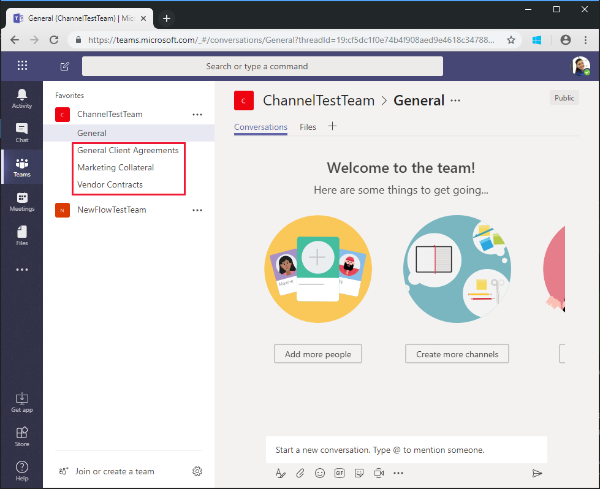

<!-- markdownlint-disable MD002 MD041 -->

El flujo que ha creado en el ejercicio anterior usa `$batch` la API para realizar dos solicitudes individuales a Microsoft Graph. La llamada `$batch` al punto de conexión de esta forma proporciona alguna ventaja y flexibilidad, pero la `$batch` verdadera potencia del punto de conexión viene cuando ejecuta varias solicitudes a Microsoft `$batch` Graph en una sola llamada. En este ejercicio, ampliará el ejemplo de creación de un grupo unificado y asociando un equipo para incluir la creación de varios canales predeterminados para `$batch` el equipo en una sola solicitud.

Abra [Microsoft Flow](https://flow.microsoft.com) en el explorador e inicie sesión con su cuenta de administrador de inquilinos de Office 365. Seleccione el flujo que creó en el paso anterior y elija **Editar**.

Elija **nuevo paso** y escriba `Batch` en el cuadro de búsqueda. Agregue la acción **conector por lotes de MS Graph** . Elija los puntos suspensivos y cambie el nombre de `Batch POST-channels`esta acción a.

Agregue el código siguiente en el cuadro de texto **Body** de la acción.

```json
{
  "requests": [
    {
      "id": 1,
      "url": "/teams/REPLACE/channels",
      "headers": {
        "Content-Type": "application/json"
      },
      "method": "POST",
      "body": {
        "displayName": "Marketing Collateral",
        "description": "Marketing collateral and documentation."
      }
    },
    {
      "id": 2,
      "dependsOn": [
        "1"
      ],
      "url": "/teams/REPLACE/channels",
      "headers": {
        "Content-Type": "application/json"
      },
      "method": "POST",
      "body": {
        "displayName": "Vendor Contracts",
        "description": "Vendor documents, contracts, agreements and schedules."
      }
    },
    {
      "id": 3,
      "dependsOn": [
        "2"
      ],
      "url": "/teams/REPLACE/channels",
      "headers": {
        "Content-Type": "application/json"
      },
      "method": "POST",
      "body": {
        "displayName": "General Client Agreements",
        "description": "General Client documents and agreements."
      }
    }
  ]
}
```

Observe que las tres solicitudes anteriores usan la propiedad [DEPENDSON](https://docs.microsoft.com/graph/json-batching#sequencing-requests-with-the-dependson-property) para especificar un orden secuencial, y cada una de ellas ejecutará una solicitud post para crear un nuevo canal en el nuevo equipo.

Seleccione cada instancia del `REPLACE` marcador de posición y, a continuación, seleccione **expresión** en el panel de contenido dinámico. Agregue la fórmula siguiente a la **expresión**.

```js
body('Batch_PUT-team').responses[0].body.id
```


Elija **Guardar**y, a continuación, elija **prueba** para ejecutar el flujo. Seleccione el botón de opción **voy a realizar la** acción desencadenadora y, a continuación, elija **Guardar prueba de &**. Escriba un nombre de grupo único en el campo **nombre** sin espacios y elija **Ejecutar flujo** para ejecutar el flujo.


Una vez que se inicie el flujo, seleccione el vínculo **ver actividad de ejecución de flujo** y, a continuación, elija el flujo de ejecución para ver el registro de actividades.

Una vez finalizado el flujo, el resultado final de `Batch POST-channels` la acción tiene una respuesta de Estado HTTP de 201 para cada canal creado.


Vaya a [Microsoft Teams](https://teams.microsoft.com) e inicie sesión con su cuenta de administrador de inquilinos de Office 365. Compruebe que el equipo que acaba de crear aparece e incluye los tres canales creados por `$batch` la solicitud.



Aunque la acción `Batch POST-channels` anterior se implementó en este tutorial como una acción independiente, las llamadas para crear los canales podrían haberse agregado como llamadas adicionales en la `Batch PUT-team` acción. Esto habría creado el equipo y todos los canales en una sola llamada por lotes. Pruebe el propio.

Por último, recuerde que las llamadas de [procesamiento por lotes JSON](https://docs.microsoft.com/graph/json-batching) devolverán un código de estado http para cada solicitud. En un proceso de producción, es posible que desee combinar el posprocesamiento de los resultados [`Apply to each`](https://docs.microsoft.com/flow/apply-to-each) con una acción y validar cada respuesta individual que tenga un código de estado de 201 o compensar otros códigos de estado recibidos.